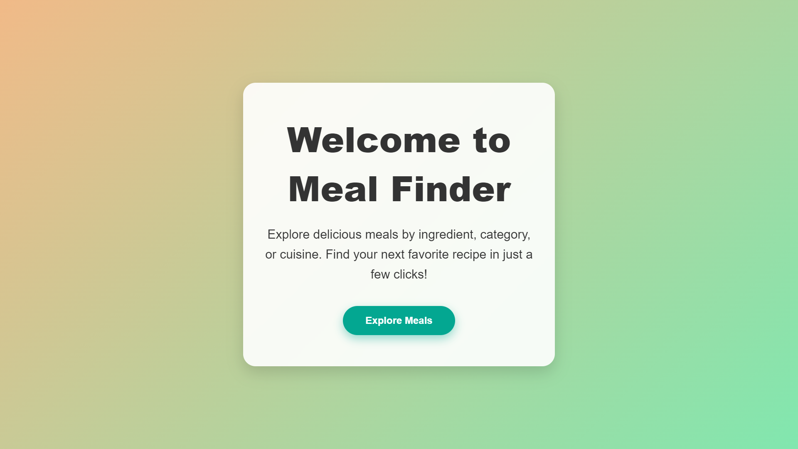
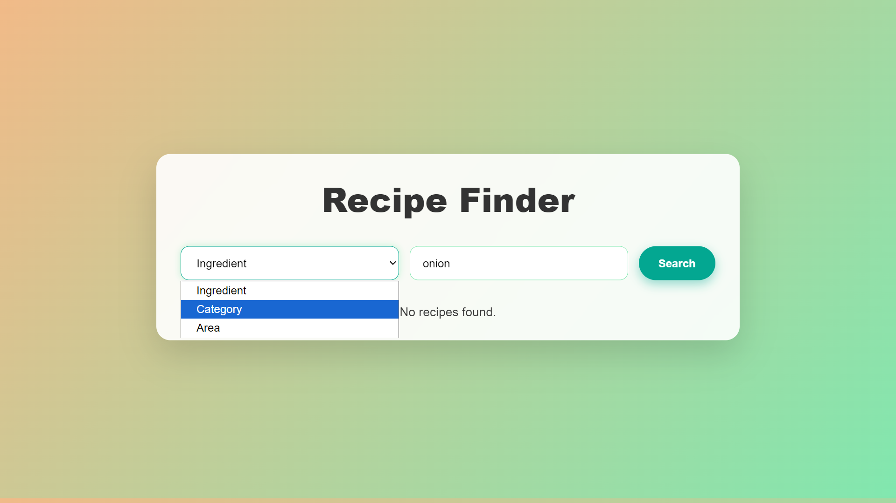
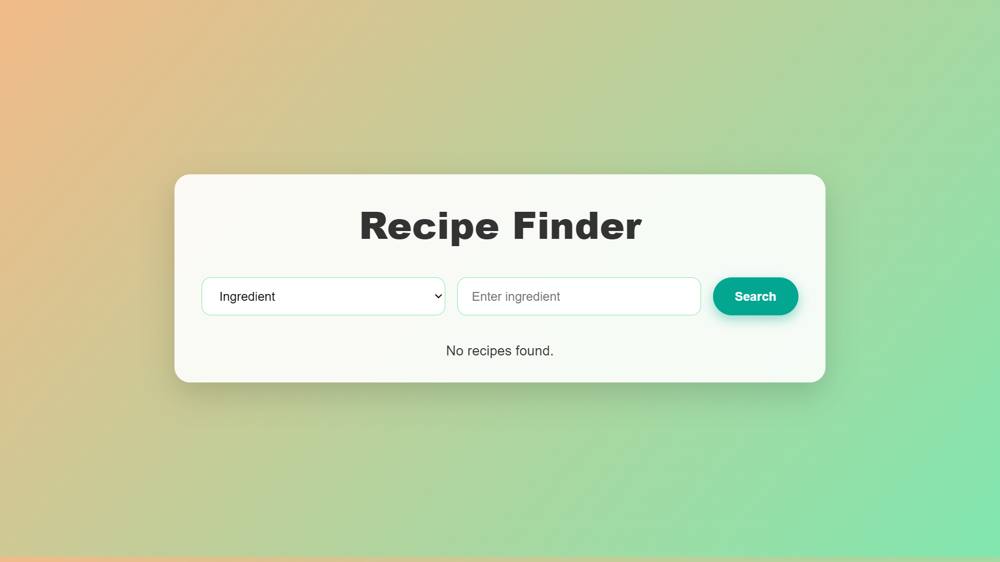
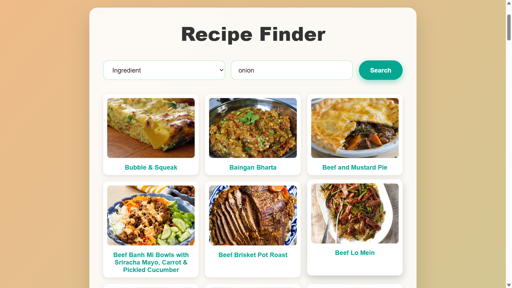

# 🍳 Recipe App 

A modern, responsive React web application for discovering, searching, and exploring meal recipes. Built with Vite for blazing-fast development, Kitchen App features a clean UI, modular code, and seamless integration with [TheMealDB API](https://www.themealdb.com/api.php).

---

> _This project was built with the help of [ChatGPT](https://chatgpt.com/share/68c04b8d-fa9c-8001-b60a-928643f58208)._

---

## 🚀 Features

- **Smart Search:** Find meals by name, ingredient, category, or area.
- **Rich Details:** View ingredients, instructions, and meal images.
- **Category Browsing:** Explore meals by category or cuisine.
- **Responsive UI:** Works beautifully on desktop and mobile.
- **Fast & Lightweight:** Powered by Vite and optimized React components.
- **Scoped Styling:** CSS Modules for maintainable, modular styles.
- **Easy to Extend:** Clean, well-organized codebase.

---

## 🖼️ Screenshots & Demo

| Home Page | Search Categories | Search Page | Search Results |
|-----------|------------------|-------------|---------------|
|  |  |  |  |

**Responsive Design Demo:**  


---

## 🗂️ Project Structure

```
k2/
├── public/
│   ├── vite.svg
│   └── images/
│       ├── homePage.png
│       ├── responsiveness.gif
│       ├── SearchCategories.png
│       ├── SearchPage.png
│       └── SearchResults.png
├── src/
│   ├── api/
│   │   └── meals.js
│   ├── assets/
│   │   └── react.svg
│   ├── components/
│   │   ├── HomePage.jsx
│   │   ├── HomePage.css
│   │   ├── SearchPage.jsx
│   │   ├── SearchPage.css
│   │   ├── SearchResults.jsx
│   │   └── SearchResults.css
│   ├── App.jsx
│   ├── App.css
│   ├── index.css
│   └── main.jsx
├── index.html
├── package.json
├── vite.config.js
├── eslint.config.js
└── README.md
```

---

## 🛠️ Getting Started

### Prerequisites

- [Node.js](https://nodejs.org/) v16 or higher
- npm or yarn

### Installation

```bash
git clone <repository-url>
cd k2
npm install
# or
yarn install
```

### Running the App

```bash
npm run dev
# or
yarn dev
```
Visit [http://localhost:5173](http://localhost:5173) in your browser.

### Building for Production

```bash
npm run build
# or
yarn build
```

---

## 🔗 API Integration

This app uses [TheMealDB API](https://www.themealdb.com/api.php) for meal data.

- **Search by ingredient, category, or area:**
  ```
  GET https://www.themealdb.com/api/json/v1/1/filter.php?i=chicken
  GET https://www.themealdb.com/api/json/v1/1/filter.php?c=Seafood
  GET https://www.themealdb.com/api/json/v1/1/filter.php?a=Indian
  ```
- **Get full details of a meal by ID:**
  ```
  GET https://www.themealdb.com/api/json/v1/1/lookup.php?i=<idMeal>
  ```

> **Note:** Multiple filters cannot be combined in a single API call. To combine filters, fetch results separately and intersect them in code using the `idMeal`.

---

## 🧑‍💻 Usage Example

```jsx
import { fetchMealsByIngredient } from './api/meals';

async function searchMeals() {
  const meals = await fetchMealsByIngredient('chicken');
  console.log(meals); // List of meals with names, images, and IDs
}
```

---

## 🎨 Styling

- **CSS Modules:** Scoped styles for each component.
- **Global Styles:** `index.css` for base styles.
- **Customizable:** Edit component `.css` files for your own look.

---

## 🧹 Linting

Check code quality with ESLint:

```bash
npm run lint
# or
yarn lint
```

---
